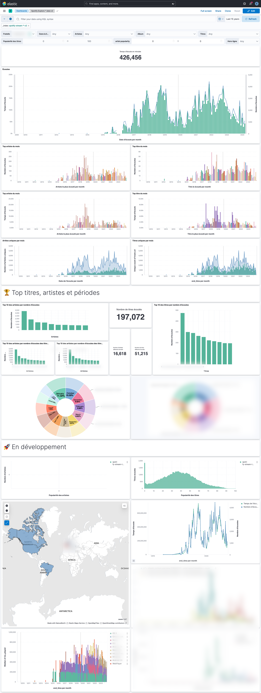

# Sploty

🎧 Visualize and understand my Spotify data.

🚧 Work-in-progress repository

- [How do I configure Sploty?](#how-do-i-configure-sploty)
- [How do I use Sploty?](#how-do-i-use-sploty)

## How do I configure Sploty?

Clone this repository.

Install [uv](https://docs.astral.sh/uv/).

Create the virtualenv and install the dependencies with uv

```shell
cd sploty/
uv sync
```

This project uses environment variables such as `SPOTIFY_CLIENT_ID`.
You should add them to the `.env` file.

Environment variables are specified in the `sample.env` file, copy it and complete it

```shell
cp sample.env .env
```

- [Complete it with the Spotify configuration](#spotify)
- [Complete it with the Elasticsearch configuration](#elasticsearch)

### Spotify

Sploty requires a Spotify developer account, look at the [Spotify documentation](https://developer.spotify.com/documentation/web-api/tutorials/getting-started) to set it up.

Retrieve the customer's id and secret and complete the `.env` file

```bash
SPOTIFY_CLIENT_ID="YOUR SPOTIFY CLIENT ID"
SPOTIFY_CLIENT_SECRET="YOUR SPOTIFY CLIENT SECRET"
SPOTIFY_AUTH_URL="https://accounts.spotify.com/api/token"
SPOTIFY_BASE_URL="https://api.spotify.com/v1/"
```

Timeout and sleep could be configured with the Sploty args.

### Elasticsearch

The final part (`to_elastic.py`) required Elasticsearch, have a look at [`docker-elk`](https://github.com/deviantony/docker-elk) to configure it locally.

Retrieve host, username and password and complete the `.env` file

```bash
ELASTIC_HOSTS=["YOUR ELASTIC HOST"]
ELASTIC_USER="YOUR ELASTIC USERNAME"
ELASTIC_PASS="YOUR ELASTIC PASSWORD"
```

Timeout and index name could be configured with the Sploty args.

## How do I use Sploty?

### ⬇️ Download your data

1. Request your spotify data on [your spotify account](https://www.spotify.com/account/privacy/)
   - Select "*Extended streaming history*"
   - Click on "*Request data*"
2. 30 days later
3. Open the mail from Spotify and download files

### 🚀 Transform your data 

Run the app

```shell
uv run python sploty/app.py \
  --resources-path your/path/to/the/extended_streaming_history_folder/ \
  --db-path your/path/to/a/folder/to/save/tracks/data \
  --index-name your-index-name
```

You can also reduce the syntax with `uv run sploty` instead of `uv run python sploty/app.py` (thanks to the `[project.scripts]` added to `pyproject.toml` file).


```shell
uv run sploty \
  --resources-path your/path/to/the/extended_streaming_history_folder/ \
  --db-path your/path/to/a/folder/to/save/tracks/data \
  --index-name your-index-name
```

#### But what does the app do?

The app will : 
1. Concat all streams files with `sploty/concat.py`
2. Filter already enriched streams with poetry run `sploty/filter.py`
3. Enrich spotify metadata with `sploty/enrich.py`
   - The Spotify API is used at this stage, don't forget to [configure it](#spotify)
4. Enrich spotify audio features with  `sploty/audio_features.py`
   - The Spotify API is used at this stage, don't forget to [configure it](#spotify)
   - A `json database` ([TinyDB](https://github.com/msiemens/tinydb)) is used at this stage to reduce Spotify API calls by storing tracks data
5. Add additional metrics with `sploty/metrics.py` 
6. Index their to elastic with `sploty/to_elastic.py`
   - Elasticsearch is used at this stage, don't forget to [configure it](#elasticsearch)

#### How to display the help message?

Use the `--help` option

```shell
uv run python sploty/app.py --help
```

#### How to use a previous `sploty_enriched_history` file?

By default, the `sploty_enriched_history` file in the resources folder is used, but you can choose another one with the `--previous-enriched-streaming-history-path` option

```shell
uv run python sploty/app.py … --previous-enriched-streaming-history-path your/path/to/another/sploty_enriched_history.csv
```

#### How to skip a part?

Use the `-no-<the part>` options

```shell
uv run python sploty/app.py … --no-concat --no-filter --no-enrich --no-feature --no-metric --no-elastic
```

#### How to increase or reduce the number of lines processed at once?

Use the `--chunk-size` option, default is 100

```shell
uv run python sploty/app.py … --chunk-size 101
```

### 👀 Visualize your data

Open Kibana ([`http://localhost:5601`](http://localhost:5601) with `docker-elk`) and create a dashboard to query your index

🚧 This part is not yet in the repository


